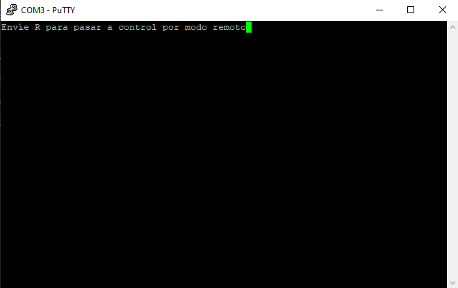

# 66.09-Laboratorio-de-Microcomputadoras-TPFinal
###Trabajo práctico final de la materia laboratorio de microcomputadoras :microscope: :computer:

Integrantes:
    -   Perez Andrade, Violeta - 101456
    -   Torresetti, Lisandro - 99846

El trabajo consiste en realizar un programa que simule el movimiento de un ojo utilizando dos servo-motores, un joystick y el puerto serie. Se realizó un ojo animatrónico que se puede controlar tanto desde el teclado como desde un joystick.

